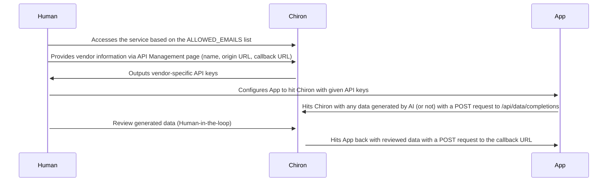

[](https://github.com/eutiveumsonho/chiron/fork)

<p align="center">
  
  <h3 align="center">Chiron - Human-in-the-loop back-office service</h3>
  <p align="center">Make your AI system smarter.</p>
</p>

---

## What is this?

Chiron was designed to be a simple service that enables you to create a human-in-the-loop system for your AI models (but you can use it for any other task that requires human input).

It offers:
- An API that allows you to send any JSON to Chiron, and receive the reviewed data back to a specified callback URL.
- A visual interface to review data, correct or adjust it, and add more data to it (such as labels).

Chiron is currently being used on the human review pipeline of AI generated data from [Eu tive um sonho](https://eutiveumsonho.com).

### How does it work?



## How can I run this on my own machine?

Create a `.env.local` file based on the [`.env.example`](.env.example) file. You will need access to a SMTP server credentials, a MongoDB instance and to set up an encryption key to spin this service. You can generate a key using the following command:

```sh
openssl rand -base64 32
```

After generating the key, paste it as the `ENCRYPTION_KEY` value from the `.env.local` file.

Include all emails that should be able to sign in to the application on the `ALLOWED_EMAILS` environment variable.

You're good to go now. Install the dependencies and run the development server:

```sh
bun
```

```sh
bun dev
```

Open [http://localhost:3000](http://localhost:3000) with your browser to see the result.

## How can I deploy this on my own server?

Before deploying this service, make sure you have access to a:
- SMTP server
- MongoDB instance

Take a look at the `.env.example` file to see which environment variables you need to set up the application.

This project is deployed using [Vercel](https://vercel.com/). You can deploy your own instance using the button below (but feel free to deploy it anywhere else - this project doesn't rely on any Vercel-specific feature):

[](https://vercel.com/import/project?template=https://github.com/eutiveumsonho/chiron)

### How can I use this service?

After deploying the service, you can access the API Management page by accessing the `/api-management` route. You will need to create a vendor to get your API keys. A vendor is a service that will be using Chiron to review data. You can create as many vendors as you want.

While creating a vendor, you will need to provide the following information:

| Field        | Description                                               |
| ------------ | --------------------------------------------------------- |
| Name         | The name of your vendor.                                  |
| Origin URL   | The URL of your application.                              |
| Callback URL | The URL where Chiron will send the reviewed data back to. |

Once you've created a vendor, copy and paste its API keys and vendor ID to your application. You can now start sending data to Chiron. You can send data to Chiron by hitting the `/api/data/completions` route with a POST request. The data you send should be in the following format:

```js
fetch("https://yourdomain.com/api/data/completions", {
    method: "POST",
    headers: {
      vendorId, // The generated vendor ID here
      apiKey, // The generated API key here
      "Content-Type": "application/json",
    },
    body: JSON.stringify(data) // Your data here,
  })
```