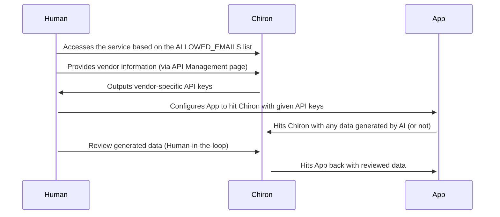

<p align="center">
  
  <h3 align="center">Chiron - Human-in-the-loop back-office service</h3>
  <p align="center">Make your AI system smarter.</p>
</p>

---

## Development

Create a `.env.local` file based on the [`.env.example`](.env.example) file. You will need access to a SMTP server credentials, a MongoDB instance and to set up an encryption key to spin this service. You can generate a key using the following command:

```sh
openssl rand -base64 32
```

After generating the key, paste it as the `ENCRYPTION_KEY` value from the `.env.local` file.

Include all emails that should be able to sign in to the application on the `ALLOWED_EMAILS` environment variable.

You're good to go now. Install the dependencies and run the development server:

```sh
bun
```

```sh
bun dev
```

Open [http://localhost:3000](http://localhost:3000) with your browser to see the result.

## Deployment

Before deploying this service, make sure you have access to a:
- SMTP server
- MongoDB instance

Take a look at the `.env.example` file to see which environment variables you need to set up.

This project is deployed using [Vercel](https://vercel.com/). You can deploy your own instance using the button below (feel free to deploy it anywhere else):

[](https://vercel.com/import/project?template=https://github.com/eutiveumsonho/chiron)

## Human-in-the-loop sequence

